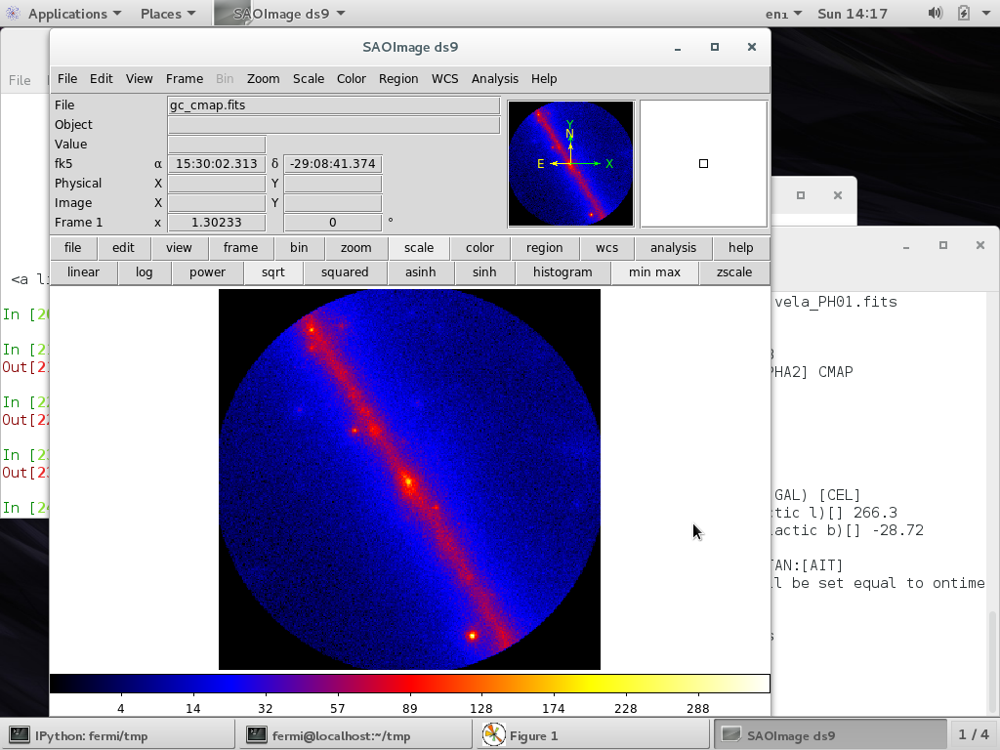

# Exploring The Data

## quick inspection of spectra, LC

[comment]: <> (http://fermi-hero.readthedocs.io/en/latest/getting_started/explore_events.html) 

energy distribution

time series

- - - 

Next, we create a Counts Map of the ROI, summed over photon energies, in order to identify candidate sources and to ensure that the field looks sensible as a simple sanity check.

For creating the Counts Map, we will use the *gtbin** *tool with the option "CMAP" (no spacecraft file is necessary for this step). Then we will view the output file, as shown below:

<table>
  <tr>
    <td>>> gtbin
>> Type of output file (CCUBE|CMAP|LC|PHA1|PHA2|HEALPIX) [PHA2] CMAP
Event data file name[] 3C279_region_filtered_gti.fits
Output file name[] 3C279_cmap.fits
Spacecraft data file name[] NONE
Size of the X axis in pixels[] 300
Size of the Y axis in pixels[] 300
Image scale (in degrees/pixel)[] 0.08
Coordinate system (CEL - celestial, GAL -galactic)[] CEL
First coordinate of image center in degrees (RA or galactic l)[] 193.98
Second coordinate of image center in degrees (DEC or galactic b)[] -5.82
Rotation angle of image axis, in degrees[] 0.0
Projection method Projection method e.g. AIT|ARC|CAR|GLS|MER|NCP|SIN|STG|TAN:[] AIT
gtbin: WARNING: No spacecraft file: EXPOSURE keyword will be set equal to ontime.</td>
  </tr>
</table>

UPDATE THIS WITH THE NEW ROI
We chose an ROI of 12 degrees, corresponding to 24 degrees in diameter. Since we want a pixel size of 0.08 degrees/pixel, then we must select 24/0.08=300 pixels for the size of the x and y axes. 

## Plot an image: The counts Map

Making a Counts Map With *gtbin*
python way
ds9 way

- - - 

In this section, in addition to the Fermi Science Tools, you will also be using a software called *ds9*, which is a FITS File Viewer.

*ds9* gives you much more interactive control of how you explore the data. Starting it up is easy, just type:

<table>
  <tr>
    <td>>> ds9 3C279_cmap.fits & </td>
  </tr>
</table>

You can see several strong sources and a number of weaker sources in the map.

It is important to inspect your data prior to proceeding to verify that the contents are as you expect. A malformed data query or improper data selection can generate a non-circular region, or a file with zero events. By inspecting your data to analysis, you have an opportunity to detect such issues early in the analysis.

IMPROVING THE IMAGE VISUALIZATION
SCALE => SQRT
COLOR => B
ZOOM => FIT

you should get something like this (in the case of the GC):

what is the source in the lower right corner of the image?

play around

## Viewing the Counts Map with *python* (if necessary)

Since many people are using remotely the same computer in this lab, it can get too slow when we use *ds9*. If this is the case, there is another way to generate the Counts Map that is much more computer efficient, but will not provide opportunities to explore the data further.

Just follow these steps:

<table>
  <tr>
    <td>>> fermi
>> ipython

import pyfits
cmap = pyfits.open('3C279_cmap.fits')
import matplotlib.pyplot as plt
fig = plt.figure(figsize=(16,8))
plt.imshow(cmap[0].data)
plt.colorbar()
plt.show()</td>
  </tr>
</table>

